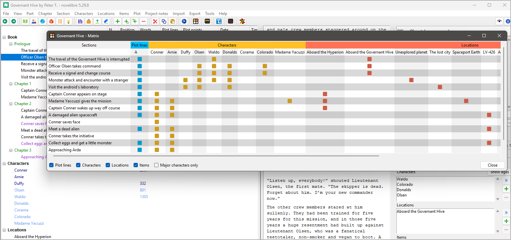

#  Python program helps authors organize novels.  

*nv_matrix* is a plugin providing a section relationship matrix. 

## Features

- The plugin adds a **Matrix** entry to the *novelibre* main menu.
- Display section relationships to characters, locations, items, and arcs with a spreadsheet-like matrix.
- Add/Remove relationships by klicking on the nodes.

## Requirements

- [novelibre](https://github.com/peter88213/novelibre/) version 2.1+

## Download and install

[Download the latest release (version 2.0.0)](https://github.com/peter88213/nv_matrix/raw/main/dist/nv_matrix_v2.0.0.zip)

- Extract the "nv_matrix_v2.0.0" folder from the downloaded zipfile "nv_matrix_v2.0.0.zip".
- Move into this new folder and launch **setup.pyw**. This installs the plugin for the local user.

---

[Changelog](docs/changelog.md)

## Usage

See the [instructions for use](docs/usage.md)

## Credits

- The icons are made using the free *Pusab* font by Ryoichi Tsunekawa, [Flat-it](http://flat-it.com/).

## License

This is Open Source software, and the *nv_matrix* plugin is licensed under GPLv3. See the
[GNU General Public License website](https://www.gnu.org/licenses/gpl-3.0.en.html) for more
details, or consult the [LICENSE](https://github.com/peter88213/nv_matrix/blob/main/LICENSE) file.
